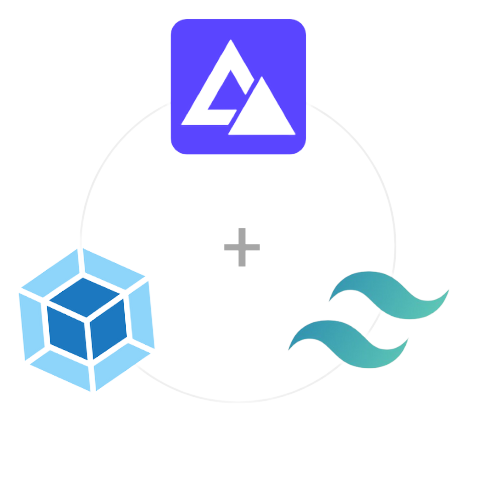

# Simple configuration for starting a new project whit AdonisJS, Webpack and Tailwindcss

## Install :

#### Start by cloning the git repository

1. git clone **https://github.com/RonalDeveloper/AdonisJS-Webpack-Tailwindcss.git**
2. cd AdonisJS-Webpack-Tailwindcss

#### Install dependencies
 
2. yarn install 

## Run development environment :

- yarn run dev 

