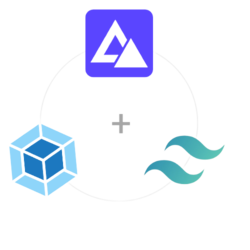

# Basic configuration for starting a new project whit AdonisJS, Webpack and Tailwindcss.

#### Cloning

```shell
git clone https://github.com/Kimonocode/AdonisJS-Webpack-Tailwindcss.git
```
#### Go to folder

```shell
cd AdonisJS-Webpack-Tailwindcss
```
#### Install dependencies

```shell
yarn install
```
#### Run development environment

```shell
yarn run dev
```
##  Security

```diff
+ The APP_KEY environment variable in the .env file is a fake variable. 
+ You absolutely must change it for production !
```


